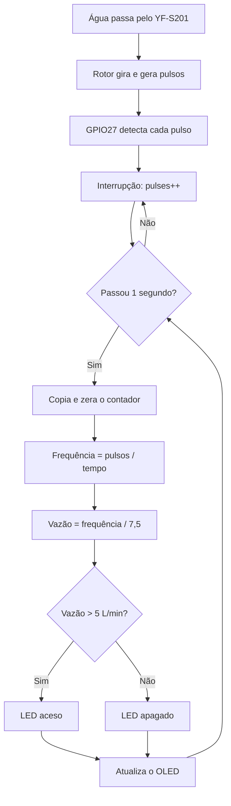

# Sistema de Monitoramento de Fluxo de Água com ESP32


Protótipo que mede quanta água está passando por um cano usando um **ESP32**, um sensor de fluxo **YF-S201**, um display **OLED SSD1306** e um **LED de alerta**. O projeto é desenvolvido com **PlatformIO** e simulado no **[Wokwi](https://wokwi.com)**.

<!-- Quando tiver um GIF ou print da simulação, salve em docs/imagens/ e remova os marcadores de comentário:

-->

<!-- Link público do projeto no Wokwi:
**Simulação online:** https://wokwi.com/projects/SEU_ID_AQUI
-->

> **Status:** em validação. O código e a documentação da primeira versão estão prontos, mas ainda não foram testados na simulação. Cada etapa abaixo só é marcada como concluída depois de verificada.

---

## Status do desenvolvimento

| Etapa | Objetivo | Situação |
|---|---|---|
| 1 | Estrutura do repositório, código e documentação | Concluída |
| 2 | Compilar o firmware com o PlatformIO | A fazer |
| 3 | Simular no Wokwi: OLED, LED e geração de pulsos | A fazer |
| 4 | Validar o cálculo de vazão e o alerta em toda a faixa do potenciômetro | A fazer |

Ao concluir a etapa 4, o projeto recebe sua primeira versão, a **v0.1.0**. O histórico de mudanças está no [CHANGELOG.md](CHANGELOG.md).

---

## A ideia em uma frase

> A água faz girar uma pequena hélice dentro do sensor. Cada volta gera pulsos elétricos. O ESP32 conta esses pulsos, calcula a vazão e mostra o resultado na tela. Se a vazão passar de um limite, o LED acende.

Esse é o mesmo princípio de qualquer sistema de monitoramento:

```
Fenômeno físico → Sensor → Sinal elétrico → Processamento → Informação
   (água)       (YF-S201)    (pulsos)         (ESP32)      (OLED + LED)
```

---

## Como funciona

### 1. O sensor transforma água em pulsos

O YF-S201 tem um rotor interno. Quando a água passa, o rotor gira e o sensor envia um pulso elétrico a cada fração de volta:

```
____|‾‾|____|‾‾|____|‾‾|____|‾‾|____
```

O ESP32 **não recebe** "a vazão é 4 L/min". Ele recebe apenas pulsos, algo como "chegaram 30 pulsos neste segundo". Todo o resto é cálculo.

### 2. A regra é simples: mais água, mais pulsos

| Situação | Rotor | Pulsos por segundo | Vazão calculada |
|---|---|---|---|
| Pouca água | Gira devagar | Poucos | Baixa |
| Muita água | Gira rápido | Muitos | Alta |

### 3. O ESP32 faz as contas



### 4. A matemática

| Grandeza | O que é | Unidade | Como é obtida |
|---|---|---|---|
| **Pulsos** | O que o sensor entrega | pulsos | Contados pela interrupção |
| **Frequência** | Pulsos por segundo | Hz | `pulsos ÷ tempo` |
| **Vazão** | Volume de água por minuto | L/min | `frequência ÷ 7,5` |

**Exemplo:** 30 pulsos em 1 segundo → 30 Hz → 30 ÷ 7,5 = **4 L/min**

> **Importante:** o valor **7,5** é uma referência comum para o YF-S201, não uma constante exata. Cada sensor físico deve ser calibrado (veja [docs/calibracao.md](docs/calibracao.md)).

---

## Componentes

| Componente | Função no projeto |
|---|---|
| ESP32 DevKit | O "cérebro": conta pulsos, calcula e controla tudo |
| Sensor YF-S201 | Transforma o fluxo de água em pulsos elétricos |
| OLED SSD1306 0,96" (I2C) | Mostra pulsos, frequência e vazão |
| LED + resistor 220 Ω | Alerta visual quando a vazão passa do limite |
| Protoboard e jumpers | Montagem sem solda |
| Cabo USB | Alimentação e programação |

Lista completa, com especificações e itens da montagem física: [hardware/lista-de-materiais.md](hardware/lista-de-materiais.md).

---

## Ligações

| Componente | Pino do componente | ESP32 |
|---|---|---|
| OLED | VCC | 3V3 |
| OLED | GND | GND |
| OLED | SDA | GPIO 21 |
| OLED | SCL | GPIO 22 |
| YF-S201 | Sinal (amarelo) | GPIO 27 |
| LED | Ânodo (via resistor 220 Ω) | GPIO 25 |
| LED | Cátodo | GND |

**Apenas na simulação (Wokwi):**

| Componente | Ligação | Função |
|---|---|---|
| Fio de jumper | GPIO 26 → GPIO 27 | Leva os pulsos simulados até a entrada do sensor |
| Potenciômetro | SIG → GPIO 34, VCC → 3V3, GND → GND | Funciona como uma "torneira" virtual |

> **Atenção na montagem física:** o YF-S201 é alimentado com **5 V** e seu sinal pode chegar a 5 V, mas os GPIOs do ESP32 suportam apenas **3,3 V**. Use um divisor de tensão no fio de sinal (esquema em [hardware/lista-de-materiais.md](hardware/lista-de-materiais.md)).

---

## Simulação

O Wokwi não possui o sensor YF-S201. Como o ESP32 só precisa enxergar **pulsos**, o próprio ESP32 gera esses pulsos no GPIO 26, e um fio os leva até o GPIO 27. Para o programa, é como se o sensor real estivesse conectado.

```
Montagem real:    YF-S201 ──────────────→ GPIO27 → interrupção → contador
Simulação:        Potenciômetro → GPIO26 → GPIO27 → interrupção → contador
```

Girando o potenciômetro, a frequência varia de 0 a 75 Hz, o que equivale a uma vazão de 0 a 10 L/min:

| Posição do potenciômetro | Frequência | Vazão | LED |
|---|---|---|---|
| Mínimo | 0 Hz | 0 L/min | Apagado |
| Metade | ~37 Hz | ~5 L/min | Limite |
| Máximo | 75 Hz | 10 L/min | Aceso |

Para alternar entre simulação e sensor real, basta mudar uma linha em `include/config.h`:

```cpp
#define MODO_SIMULACAO 1   // 1 = Wokwi | 0 = sensor real
```

### O que aparece no display

```
MONITOR DE FLUXO

Pulsos: 30
Freq.: 30.0 Hz
Vazao: 4.00 L/min

Alerta: nao
```

---

## Como rodar

### Opção 1: VS Code (recomendado)

Pré-requisitos: [VS Code](https://code.visualstudio.com) com as extensões **PlatformIO IDE** e **Wokwi Simulator**.

1. Clone o repositório e abra a pasta no VS Code.
2. Ative a licença do Wokwi: pressione `F1` e escolha **Wokwi: Request a New License**.
3. Compile: clique no ícone de visto na barra inferior ou use `Ctrl+Alt+B`. A primeira compilação demora alguns minutos.
4. Simule: pressione `F1` e escolha **Wokwi: Start Simulator**.
5. Gire o potenciômetro e acompanhe o display e o LED.

> Sempre que alterar o código, compile de novo antes de simular. O Wokwi executa o último firmware compilado.

### Opção 2: Wokwi no navegador

1. Crie um novo projeto **ESP32** em [wokwi.com](https://wokwi.com).
2. Copie `src/main.cpp` para a aba **sketch.ino**.
3. Crie uma aba chamada **config.h** e copie `include/config.h`.
4. Copie `diagram.json` para a aba **diagram.json**.
5. Adicione as bibliotecas **Adafruit GFX Library** e **Adafruit SSD1306** pelo Library Manager.
6. Clique no botão verde de iniciar.

> **Dica:** a mensagem *"Build Servers Busy"* não é erro no projeto. É fila nos servidores gratuitos do Wokwi. Nesse caso, prefira a opção 1.

---

## Estrutura do código

| Parte | O que faz |
|---|---|
| `countPulse()` | Função de interrupção: soma 1 ao contador a cada pulso |
| `setup()` | Roda uma vez: configura pinos, OLED e interrupção |
| `loop()` | Roda sempre: a cada 1 s calcula a vazão, atualiza o LED e o display |
| `atualizaDisplay()` | Escreve pulsos, frequência, vazão e alerta no OLED |
| `atualizaSimulacao()` | Só no Wokwi: lê o potenciômetro e ajusta os pulsos gerados |

**Por que usar interrupção?** Em vez de o ESP32 ficar perguntando o tempo todo "chegou pulso?", o próprio hardware avisa quando um pulso chega. Assim nenhum pulso se perde, mesmo enquanto o display está sendo atualizado.

**Por que `millis()` e não `delay()`?** O `delay()` congela o programa. Com `millis()`, o ESP32 apenas verifica se já passou 1 segundo e continua livre para fazer outras tarefas.

O raciocínio completo por trás de cada escolha está em [docs/decisoes.md](docs/decisoes.md).

### Parâmetros ajustáveis (`include/config.h`)

```cpp
const float FATOR_CALIBRACAO = 7.5;      // Hz por L/min
const float LIMITE_VAZAO     = 5.0;      // L/min para acender o LED
const unsigned long INTERVALO_MS = 1000; // intervalo de medição
```

---

## Limitações atuais

Estas limitações são conhecidas e fazem parte da evolução planejada:

- **Não mede nível de rio.** O YF-S201 mede apenas a água que passa por dentro dele, não a altura da água.
- **Não prevê transbordamento.** Para isso seria preciso medir o nível e sua velocidade de subida.
- **Vazão não é velocidade.** Vazão é volume por tempo (L/min). Velocidade é distância por tempo (m/s). Elas se relacionam por `Q = A × v`, onde A é a área da seção.
- **Um cano não representa um rio.** Um rio tem seção muito maior e velocidades diferentes em cada ponto.
- **Protoboard é só para protótipo.** Uma instalação real exige solda, caixa vedada e proteção contra umidade.

---

## Roadmap

Cada etapa concluída vira uma versão marcada no repositório. O histórico detalhado está no [CHANGELOG.md](CHANGELOG.md).

- [ ] **v0.1.0**: medição de vazão, OLED, LED de alerta e simulação no Wokwi (em validação)
- [ ] **v0.2.0**: modo de calibração e calibração do sensor físico
- [ ] **v0.3.0**: cálculo de volume acumulado
- [ ] **v0.4.0**: sensor de nível (ultrassônico HC-SR04)
- [ ] **v0.5.0**: estimativa de tempo até o transbordamento
- [ ] **v0.6.0**: registro de dados e envio via Wi-Fi
- [ ] **v1.0.0**: montagem física completa com o sensor real

---

## Estrutura do repositório

```
├── README.md                  ← você está aqui
├── CHANGELOG.md               ← mudanças de cada versão
├── platformio.ini             ← configuração do PlatformIO
├── wokwi.toml                 ← configuração do Wokwi para VS Code
├── diagram.json               ← circuito da simulação
├── src/
│   └── main.cpp               ← lógica principal
├── include/
│   └── config.h               ← pinos e parâmetros
├── docs/
│   ├── documentacao-completa.md
│   ├── decisoes.md            ← por que cada escolha foi feita
│   ├── calibracao.md          ← procedimento de calibração
│   ├── imagens/               ← prints, GIFs e fotos
│   └── apresentacao/          ← slides do trabalho
├── hardware/
│   └── lista-de-materiais.md
├── dados/
│   └── calibracao/            ← medições dos ensaios
└── .github/workflows/
    └── build.yml              ← compilação automática
```

---