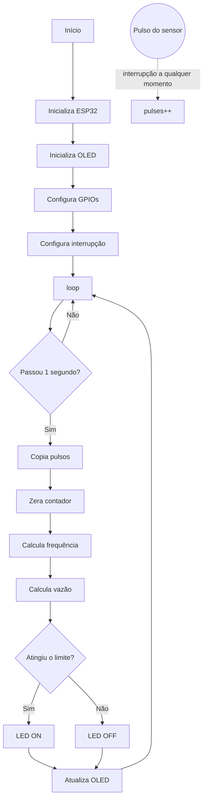

# Documentação Completa do Projeto: Sistema de Monitoramento de Fluxo de Água com ESP32

> Esta é a documentação conceitual do projeto. Para instruções de uso e o estado atual do código, veja o [README](../README.md). As justificativas técnicas estão em [decisoes.md](decisoes.md).

## Sumário

1. [Objetivo do projeto](#1-objetivo-do-projeto)
2. [Componentes utilizados](#2-componentes-utilizados)
3. [ESP32](#3-esp32)
4. [Sensor YF-S201](#4-sensor-yf-s201)
5. [Como o YF-S201 gera os dados](#5-como-o-yf-s201-gera-os-dados)
6. [Por que utilizar uma interrupção](#6-por-que-utilizar-uma-interrupção)
7. [Display OLED SSD1306 e comunicação I2C](#7-display-oled-ssd1306-e-comunicação-i2c)
8. [LED](#8-led)
9. [Ligações completas](#9-ligações-completas)
10. [Fluxo geral do sistema](#10-fluxo-geral-do-sistema)
11. [Estrutura do programa](#11-estrutura-do-programa)
12. [Medição e cálculos](#12-medição-e-cálculos)
13. [Calibração](#13-calibração)
14. [Saídas: LED e OLED](#14-saídas-led-e-oled)
15. [Fluxo completo do código](#15-fluxo-completo-do-código)
16. [O que o sistema realmente mede](#16-o-que-o-sistema-realmente-mede)
17. [Nível do rio e tempo até o transbordamento](#17-nível-do-rio-e-tempo-até-o-transbordamento)
18. [Diferença entre vazão e velocidade](#18-diferença-entre-vazão-e-velocidade)
19. [Limitações do projeto](#19-limitações-do-projeto)
20. [Simulação no Wokwi](#20-simulação-no-wokwi)
21. [Melhorias futuras](#21-melhorias-futuras)
22. [Resumo](#22-resumo)
23. [Conclusão](#23-conclusão)

---

## 1. Objetivo do projeto

O projeto consiste em um protótipo de sistema de monitoramento de água utilizando um ESP32, um sensor de fluxo YF-S201, um display OLED SSD1306 e um LED indicador.

O objetivo principal é fazer com que o ESP32:

- receba os pulsos produzidos pelo sensor YF-S201;
- conte esses pulsos;
- determine a frequência dos pulsos;
- converta essa frequência em uma estimativa de vazão;
- mostre as informações no display OLED;
- acione um LED quando uma determinada condição for atingida.

A ideia é reproduzir, em escala simples, o princípio de funcionamento de um sistema de monitoramento:

```
captar uma grandeza física → transformar em sinal elétrico → processar o sinal → apresentar uma informação
```

## 2. Componentes utilizados

| Componente | Função |
|---|---|
| ESP32 | Controlador central do sistema |
| YF-S201 | Mede o fluxo de água através de pulsos elétricos |
| OLED SSD1306 0,96" | Exibe os dados medidos |
| LED | Indicação visual de uma condição definida no código |
| Resistor de 220 Ω | Limita a corrente do LED |
| Protoboard | Permite montar o circuito sem soldagem |
| Jumpers | Realizam as conexões entre os componentes |
| Cabo USB | Alimenta e permite programar o ESP32 |

## 3. ESP32

O ESP32 é o cérebro do projeto. Ele é responsável por receber o sinal do YF-S201, contar os pulsos, calcular a frequência e a vazão, controlar o OLED e o LED e executar continuamente o programa.

| GPIO | Função |
|---|---|
| GPIO 21 | SDA do OLED |
| GPIO 22 | SCL do OLED |
| GPIO 27 | Sinal do YF-S201 |
| GPIO 25 | Controle do LED |

## 4. Sensor YF-S201

O YF-S201 possui internamente um pequeno rotor. Quando a água passa pelo sensor, o rotor gira, e o sensor transforma essa rotação em pulsos elétricos.

Portanto, o ESP32 não recebe diretamente algo como *"a vazão é 4,2 L/min"*. Ele recebe algo semelhante a *"recebi 31 pulsos durante este intervalo"*. O programa então utiliza uma relação de calibração para transformar os pulsos em uma estimativa de vazão.

```
Mais água passando          Menos água passando
       ↓                           ↓
Rotor gira mais rápido      Rotor gira mais devagar
       ↓                           ↓
Mais pulsos por segundo     Menos pulsos por segundo
       ↓                           ↓
Maior frequência            Menor frequência
       ↓                           ↓
Maior vazão calculada       Menor vazão calculada
```

## 5. Como o YF-S201 gera os dados

O sensor gera uma sequência de pulsos:

```
____|‾‾|____|‾‾|____|‾‾|____|‾‾|____
```

Cada subida do sinal (LOW → HIGH) é considerada um pulso. O ESP32 monitora o GPIO27 e, ao detectar uma subida, executa uma função especial chamada **interrupção**, que incrementa um contador:

```cpp
pulses++;
```

Se o sensor produzir 10 pulsos, o contador ficará com `pulses = 10`.

## 6. Por que utilizar uma interrupção

Seria possível fazer o ESP32 verificar constantemente o estado do GPIO, mas isso não é necessário. Com uma interrupção, o ESP32 continua executando o restante do programa e, quando o pulso aparece, o hardware chama automaticamente a função responsável por registrá-lo.

```
Sensor gera pulso → GPIO27 detecta → interrupção é acionada → countPulse() → pulses++
```

Isso é especialmente útil para sensores que podem produzir muitos pulsos.

## 7. Display OLED SSD1306 e comunicação I2C

O display é um OLED SSD1306 de 0,96 polegada, com 128 × 64 pixels, que utiliza comunicação I2C. O I2C usa duas linhas:

- **SDA** (Serial Data): dados;
- **SCL** (Serial Clock): clock.

| OLED | ESP32 |
|---|---|
| VDD | 3V3 |
| GND | GND |
| SDA | GPIO21 |
| SCL/SCK | GPIO22 |

O display normalmente utiliza o endereço I2C `0x3C`. No código, o barramento é configurado e o display inicializado com:

```cpp
Wire.begin(OLED_SDA, OLED_SCL);
display.begin(SSD1306_SWITCHCAPVCC, 0x3C);
```

## 8. LED

O LED é utilizado como indicação visual:

```
GPIO25 → resistor 220 Ω → ânodo do LED → cátodo → GND
```

O resistor é necessário para limitar a corrente. O ESP32 acende o LED com `digitalWrite(LED_PIN, HIGH)` e apaga com `digitalWrite(LED_PIN, LOW)`.

Por exemplo, o código pode definir que o LED acende quando a vazão passa de 5 L/min. Esse valor é apenas um exemplo: o limite real deve ser definido de acordo com o objetivo do projeto.

## 9. Ligações completas

```
                    ┌─────────────────┐
                    │      ESP32      │
                    │                 │
        SDA ────────│ GPIO21          │
        SCL ────────│ GPIO22          │
                    │                 │
 YF-S201 sinal ─────│ GPIO27          │
                    │                 │
 LED ───────────────│ GPIO25          │
                    │                 │
 3V3 ───────────────│ 3V3             │
                    │                 │
 GND ───────────────│ GND             │
                    └─────────────────┘
                         │
              ┌──────────┴──────────┐
              │                     │
          OLED SSD1306           YF-S201
```

## 10. Fluxo geral do sistema

```
Água passa pelo YF-S201
          ↓
Rotor interno gira
          ↓
Sensor gera pulsos
          ↓
GPIO27 recebe os pulsos
          ↓
Interrupção registra cada pulso
          ↓
ESP32 conta os pulsos
          ↓
ESP32 calcula frequência
          ↓
ESP32 converte frequência em vazão
          ↓
OLED mostra os valores
          ↓
ESP32 verifica o limite configurado
          ↓
LED é ligado ou desligado
```

## 11. Estrutura do programa

O programa é dividido em duas funções principais, `setup()` e `loop()`, além da função de interrupção `countPulse()`.

### Bibliotecas

```cpp
#include <Wire.h>              // comunicação I2C
#include <Adafruit_GFX.h>      // funções gráficas e de texto
#include <Adafruit_SSD1306.h>  // controle do SSD1306
```

### Definição dos pinos

```cpp
#define OLED_SDA 21
#define OLED_SCL 22
#define FLOW_PIN 27
#define LED_PIN 25
```

Usar nomes em vez de números facilita a leitura: `pinMode(FLOW_PIN, INPUT_PULLUP)` é mais claro que `pinMode(27, INPUT_PULLUP)`. No código atual, essas definições ficam em `include/config.h`.

### Contador de pulsos e interrupção

```cpp
volatile unsigned long pulses = 0;

void IRAM_ATTR countPulse() {
    pulses++;
}
```

O `volatile` é importante porque a variável é modificada dentro de uma interrupção.

### setup()

Executa uma única vez quando o ESP32 é ligado ou reiniciado:

```cpp
void setup() {
    Serial.begin(115200);             // Monitor Serial

    pinMode(FLOW_PIN, INPUT_PULLUP);  // sensor: entrada
    pinMode(LED_PIN, OUTPUT);         // LED: saída

    Wire.begin(OLED_SDA, OLED_SCL);

    if (!display.begin(SSD1306_SWITCHCAPVCC, 0x3C)) {
        while (true) {
            delay(1000);
        }
    }

    attachInterrupt(
        digitalPinToInterrupt(FLOW_PIN),  // qual GPIO
        countPulse,                       // qual função
        RISING                            // na subida do sinal
    );
}
```

Se o display não responder, o programa para no `while`. Isso ajuda a detectar problemas como SDA ou SCL trocados, alimentação incorreta, GND desconectado ou endereço I2C diferente.

## 12. Medição e cálculos

### Intervalo com millis()

`millis()` informa quantos milissegundos se passaram desde que o ESP32 foi iniciado. A condição abaixo significa "já passou pelo menos 1 segundo desde a última medição?":

```cpp
if (millis() - lastMeasure >= 1000)
```

Usar `delay(1000)` bloquearia o programa. Com `millis()`, o programa continua executando outras tarefas enquanto espera, e a interrupção continua registrando os pulsos.

### Capturando os pulsos

```cpp
noInterrupts();          // pausa as interrupções
unsigned long p = pulses; // copia a contagem
pulses = 0;              // prepara a próxima medição
interrupts();            // reativa as interrupções
```

Pausar as interrupções evita que o contador seja alterado enquanto o valor está sendo copiado.

### Frequência

Com uma janela de aproximadamente 1 segundo, a quantidade de pulsos é a própria frequência: 20 pulsos em 1 segundo = **20 Hz**.

### Vazão

Uma relação frequentemente utilizada com o YF-S201 é:

```cpp
float flow = frequency / 7.5;
```

| Frequência | Cálculo | Vazão |
|---|---|---|
| 15 Hz | 15 ÷ 7,5 | 2 L/min |
| 30 Hz | 30 ÷ 7,5 | 4 L/min |

O valor 7,5 deve ser tratado como uma referência comum para esse sensor, não como uma constante universal exata. O ideal é calibrar o sensor físico utilizado.

## 13. Calibração

Suponha que, ao passar exatamente 1 litro pelo sensor, sejam registrados 450 pulsos. Temos então cerca de **450 pulsos por litro**, e 900 pulsos corresponderiam a 900 ÷ 450 = 2 litros.

A calibração real deve ser feita experimentalmente:

1. Colocar a saída do sensor em um recipiente.
2. Fazer passar água.
3. Coletar um volume conhecido.
4. Contar os pulsos.
5. Comparar o volume real com o volume calculado.
6. Ajustar a constante utilizada pelo programa.

O procedimento detalhado está em [calibracao.md](calibracao.md).

## 14. Saídas: LED e OLED

### LED

```cpp
if (flow > 5.0) {
    digitalWrite(LED_PIN, HIGH);
} else {
    digitalWrite(LED_PIN, LOW);
}
```

### OLED

```cpp
display.clearDisplay();      // limpa o conteúdo anterior
display.setCursor(0, 0);     // posição inicial

display.println("Monitor de fluxo");

display.print("Pulsos: ");
display.println(p);

display.print("Freq.: ");
display.print(frequency, 1);
display.println(" Hz");

display.print("Vazao: ");
display.print(flow, 2);
display.println(" L/min");

display.display();           // envia tudo para a tela
```

Exemplo de tela:

```
MONITOR DE FLUXO

Pulsos: 30
Freq.: 30.0 Hz
Vazao: 4.00 L/min
```

## 15. Fluxo completo do código



## 16. O que o sistema realmente mede

| Grandeza | Definição | Unidade |
|---|---|---|
| Pulsos | Informação fornecida diretamente pelo sensor | pulsos |
| Frequência | Quantidade de pulsos por unidade de tempo | Hz (pulsos/segundo) |
| Vazão | Estimativa obtida pela relação entre frequência e vazão | L/min |

## 17. Nível do rio e tempo até o transbordamento

### O projeto atualmente não mede o nível do rio

O YF-S201 mede o fluxo que passa através dele. Ele não mede a altura da água nem o nível do rio. Para isso seria necessário outro sensor, por exemplo um que meça a distância entre um ponto fixo e a superfície da água.

### Tempo até o transbordamento

Para estimá-lo, seriam necessários pelo menos: nível atual, nível máximo e velocidade de subida do nível.

**Exemplo:**

- Nível atual: 80 cm
- Nível de transbordamento: 100 cm
- Faltam: 20 cm
- Velocidade de subida: 2 cm/min
- Estimativa: 20 ÷ 2 = **10 minutos**

Essa previsão depende da hipótese de que a taxa de subida permanecerá aproximadamente constante. Portanto, não é correto afirmar que o YF-S201 sozinho consegue calcular o tempo até o transbordamento.

## 18. Diferença entre vazão e velocidade

- **Vazão:** volume de água que passa por um ponto por unidade de tempo (exemplo: 10 L/min).
- **Velocidade:** rapidez com que a água se desloca (exemplo: 2 m/s).

A relação entre elas depende da área da seção:

```
Q = A × v
```

onde Q é a vazão, A é a área da seção e v é a velocidade média. O YF-S201 não fornece diretamente a velocidade de um rio.

## 19. Limitações do projeto

1. **O YF-S201 não representa um rio inteiro.** Ele mede apenas o fluxo que passa por ele. Um rio tem seção transversal muito maior e distribuição de velocidades diferente.
2. **Necessidade de calibração.** A relação entre pulsos e vazão deve ser verificada experimentalmente.
3. **Protoboard.** É adequada para prototipagem, mas não para instalação permanente em ambiente externo.
4. **Umidade.** ESP32, protoboard e conexões precisam de proteção adequada em uma aplicação real.
5. **Não existe medição de nível.** Para monitorar enchentes, seria necessário acrescentar um sensor de nível.
6. **Não há previsão confiável de transbordamento.** Uma previsão exige dados históricos, nível atual e uma forma de estimar a evolução do nível.

## 20. Simulação no Wokwi

No Wokwi, o YF-S201 é representado por um gerador de pulsos. Isso funciona porque o que interessa ao ESP32 é o sinal elétrico produzido pelo sensor.

```
Simulação:        Gerador de pulsos → GPIO27 → interrupção → contador
Montagem real:    YF-S201           → GPIO27 → interrupção → contador
```

Assim, é possível testar a lógica do programa antes de conectar o sensor físico. Na implementação atual, o gerador é o próprio ESP32 (GPIO26), com a frequência controlada por um potenciômetro (GPIO34).

| Componente | ESP32 |
|---|---|
| OLED VCC | 3V3 |
| OLED GND | GND |
| OLED SDA | GPIO21 |
| OLED SCL | GPIO22 |
| Gerador de pulsos | GPIO26 → GPIO27 |
| Potenciômetro | GPIO34 |
| LED | GPIO25 |
| LED GND | GND |

## 21. Melhorias futuras

- **Sensor de nível:** determinar a altura da água.
- **Volume acumulado:** somar a vazão ao longo do tempo.
- **Registro de dados:** armazenar horário, nível, vazão e volume.
- **Comunicação sem fio:** usar o Wi-Fi ou Bluetooth do ESP32 para enviar dados a um servidor, aplicativo, dashboard ou banco de dados.
- **Sistema de alerta:** complementar o LED com buzzer, mensagens via Wi-Fi, notificações ou painel externo.

## 22. Resumo

| Elemento | Papel |
|---|---|
| ESP32 | Processa tudo |
| YF-S201 | Transforma fluxo de água em pulsos |
| GPIO27 | Recebe os pulsos |
| Interrupção | Conta os pulsos |
| Código | Transforma pulsos em frequência e vazão |
| OLED | Mostra os resultados |
| GPIO25 | Controla o LED |
| LED | Indica uma condição |

**Em uma frase:** o ESP32 conta quantos pulsos o YF-S201 produz durante um intervalo de tempo, transforma essa quantidade em frequência, utiliza uma constante de calibração para estimar a vazão, apresenta o resultado no OLED e controla o LED de acordo com um limite definido.

```
Pulsos → pulsos/tempo → frequência → constante de calibração → vazão → OLED + LED
```

## 23. Conclusão

O projeto apresenta um sistema completo de aquisição e processamento de dados utilizando um microcontrolador. O YF-S201 transforma o movimento da água em pulsos elétricos, o ESP32 recebe esses pulsos e executa os cálculos, o OLED apresenta os resultados e o LED fornece uma indicação adicional baseada em uma condição programada.

A principal característica do projeto é a integração entre hardware e software:

```
Fenômeno físico → Sensor → Sinal elétrico → ESP32 → Processamento → Informação → Display / LED
```

Para aproximar o protótipo de um monitoramento real de rios e enchentes, os próximos passos são adicionar medição de nível, calibrar experimentalmente o sensor, registrar os dados ao longo do tempo e desenvolver uma metodologia para estimar a evolução do nível da água.
