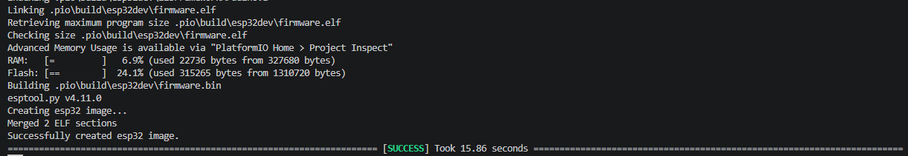

# Registro de validação

Este documento registra os testes de cada etapa do desenvolvimento. Uma etapa só é marcada como concluída no [README](../README.md) depois de ter o resultado registrado aqui.

## Resumo

| Etapa | Objetivo | Data | Resultado |
|---|---|---|---|
| 2 | Compilar o firmware com o PlatformIO | 30/09/2026 | Aprovada |
| 3 | Simular no Wokwi: OLED, LED e geração de pulsos | | Pendente |
| 4 | Validar o cálculo de vazão e o alerta em toda a faixa do potenciômetro | | Pendente |

---

## Etapa 2: compilação

**Data:** 30/09/2026

**Ambiente:**

| Item | Versão |
|---|---|
| Sistema operacional | Windows |
| Editor | VS Code com a extensão PlatformIO IDE |
| PlatformIO Core | 6.2.0 |
| Placa | `esp32dev` (ESP32 DevKit) |
| esptool | 4.11.0 |

**Procedimento:** compilação do projeto pelo botão Build do PlatformIO, sem nenhuma alteração no código.

**Critério de aprovação:** a compilação termina com `[SUCCESS]` e gera o arquivo `.pio/build/esp32dev/firmware.bin`, usado pelo Wokwi na simulação.

**Resultado:** aprovada.

| Medida | Valor |
|---|---|
| Tempo de compilação | 15,86 s |
| Uso de RAM | 6,9% (22.736 de 327.680 bytes) |
| Uso de Flash | 24,1% (315.265 de 1.310.720 bytes) |

**Análise:** o firmware ocupa menos de um quarto da memória Flash e menos de 7% da RAM. Há bastante espaço para as próximas funcionalidades do roadmap, como o sensor de nível e a comunicação Wi-Fi, que é a parte que mais consome memória.

