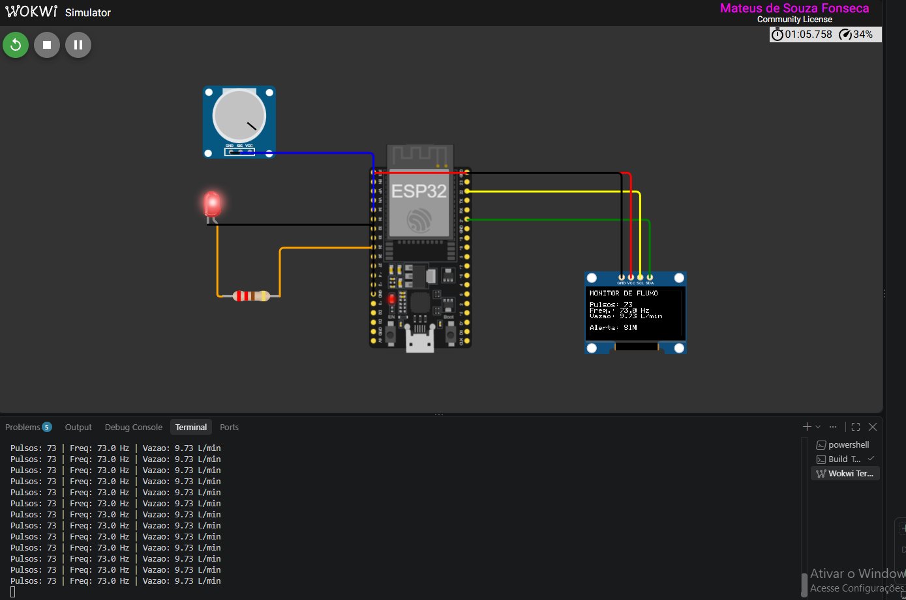

# Registro de validação

Este documento registra os testes de cada etapa do desenvolvimento. Uma etapa só é marcada como concluída no [README](../README.md) depois de ter o resultado registrado aqui.

## Resumo

| Etapa | Objetivo | Data | Resultado |
|---|---|---|---|
| 2 | Compilar o firmware com o PlatformIO | 30/09/2026 | Aprovada |
| 3 | Simular no Wokwi: OLED, LED e geração de pulsos | 30/09/2026 | Aprovada |
| 4 | Validar o cálculo de vazão e o alerta em toda a faixa do potenciômetro | | Pendente |

---

## Etapa 2: compilação

**Data:** 30/09/2026

**Ambiente:**

| Item | Versão |
|---|---|
| Sistema operacional | Windows |
| Editor | VS Code com a extensão PlatformIO IDE |
| PlatformIO Core | 6.2.0 |
| Placa | `esp32dev` (ESP32 DevKit) |
| esptool | 4.11.0 |

**Procedimento:** compilação do projeto pelo botão Build do PlatformIO, sem nenhuma alteração no código.

**Critério de aprovação:** a compilação termina com `[SUCCESS]` e gera o arquivo `.pio/build/esp32dev/firmware.bin`, usado pelo Wokwi na simulação.

**Resultado:** aprovada.

| Medida | Valor |
|---|---|
| Tempo de compilação | 15,86 s |
| Uso de RAM | 6,9% (22.736 de 327.680 bytes) |
| Uso de Flash | 24,1% (315.265 de 1.310.720 bytes) |

**Análise:** o firmware ocupa menos de um quarto da memória Flash e menos de 7% da RAM. Há bastante espaço para as próximas funcionalidades do roadmap, como o sensor de nível e a comunicação Wi-Fi, que é a parte que mais consome memória.

---

## Etapa 3: simulação no Wokwi

**Data:** 30/09/2026

**Ambiente:**

| Item | Versão |
|---|---|
| Simulador | Wokwi para VS Code (licença Community) |
| Firmware | Compilado na etapa 2, com as correções desta etapa |
| Circuito | `diagram.json` com ESP32, OLED, LED, resistor e potenciômetro |

**Procedimento:** iniciar a simulação, observar a inicialização e girar o potenciômetro do mínimo até perto do máximo, acompanhando o OLED, o LED e o Monitor Serial.

**Resultado:** aprovada.

| Critério | Esperado | Observado | Situação |
|---|---|---|---|
| Inicialização | "Sistema iniciado" no Monitor Serial | Mensagem exibida após o boot do ESP32 | Aprovado |
| OLED | Título, pulsos, frequência, vazão e alerta | Todos os campos exibidos e atualizados a cada segundo | Aprovado |
| Potenciômetro no mínimo | Valores em zero | 15 leituras seguidas com 0 pulsos | Aprovado |
| Variação da vazão | Valores acompanham o potenciômetro | Leituras de 22 a 73 pulsos por segundo ao girar | Aprovado |
| Estabilidade | Valor constante com o potenciômetro parado | 55 e 73 pulsos por segundo mantidos sem oscilação | Aprovado |
| LED de alerta | Aceso acima de 5 L/min | Aceso com 7,33 e 9,73 L/min, com "Alerta: SIM" no OLED | Aprovado |

**Conferência do cálculo:**

| Pulsos em 1 s | Frequência | Vazão esperada (f ÷ 7,5) | Vazão exibida |
|---|---|---|---|
| 55 | 55,0 Hz | 7,33 L/min | 7,33 L/min |
| 73 | 73,0 Hz | 9,73 L/min | 9,73 L/min |

**Problemas encontrados e corrigidos:**

1. **Monitor Serial em escada.** Cada leitura começava onde a anterior terminava. O `Serial.printf` terminava apenas com `\n` (nova linha), e o terminal do Wokwi também precisa de `\r` (retorno ao início da linha). Corrigido trocando o final por `\r\n`, como já faz o `Serial.println`.
2. **Fios sobre a tela do OLED.** O display estava posicionado acima dos pinos do ESP32, e os fios atravessavam a tela até os pinos do display. Corrigido movendo o OLED para baixo no `diagram.json`.

**Observações:**

- O Wokwi executou a simulação a cerca de 30% da velocidade real. Isso não afeta as medições, porque tanto o gerador de pulsos quanto o `millis()` usam o relógio simulado do ESP32.
- O comportamento do LED abaixo de 5 L/min e a precisão em toda a faixa do potenciômetro serão verificados na etapa 4.

